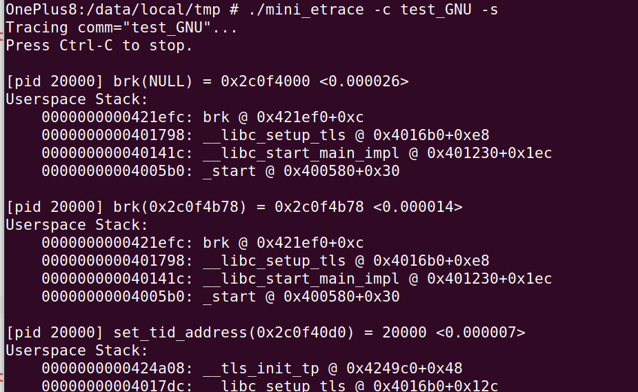

这是使用ebpf实现的一个类似strace的程序（trace 系统调用），主要测试运行在Oneplus 8（Android 11, Linux 4.19），可以trace arm64/arm32 的系统调用。

依赖如下（已在aarch64-elib编译）：

```
libbpf 0.5.0
libelf 0.186
zlib 1.2.11
blazesym 0.2.6
```

直接使用`make`编译。


使用：

```
/mini_etrace -c test_GNU -s
```




已知问题：

- 因为读取内存和解析栈地址符号发生在系统调用之后，当被trace程序退出后，就无法读取该进程空间，读取内存和解析栈地址符号就会失败
- Bionic libc的栈地址符号解析失败

```
[pid 20000] write(1, 0x2c0f5510 /* unreadable */, 1) = 1 <0.000013>
Userspace Stack:
    0000000000421020
    00000000004104cc
    000000000040f634
    0000000000410f70
    0000000000410b54
    000000000040d0d4
    0000000000401140
    00000000004011f4
    0000000000401574
    00000000004005b0

[pid 20000] write(1, 0x2c0f5510 /* unreadable */, 6) = 6 <0.000013>
Userspace Stack:
    0000000000421020
    00000000004104cc
    000000000040f634
    0000000000410f70
    00000000004116ac
    000000000040d184
    0000000000401140
    00000000004011f4
    0000000000401574
    00000000004005b0
```

